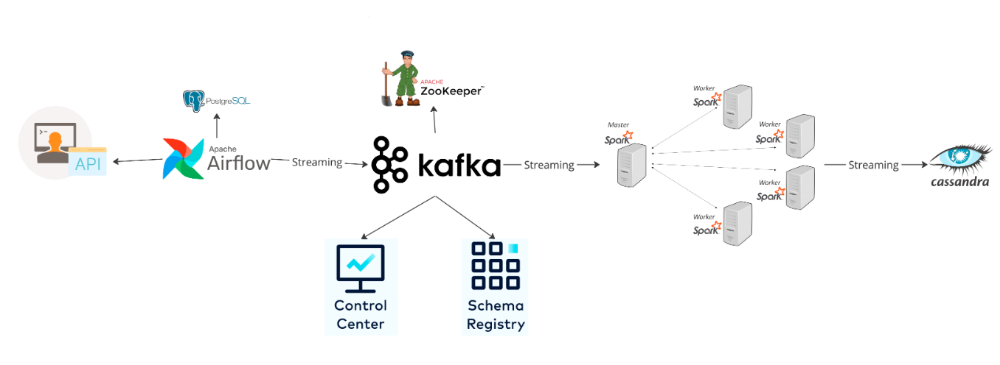
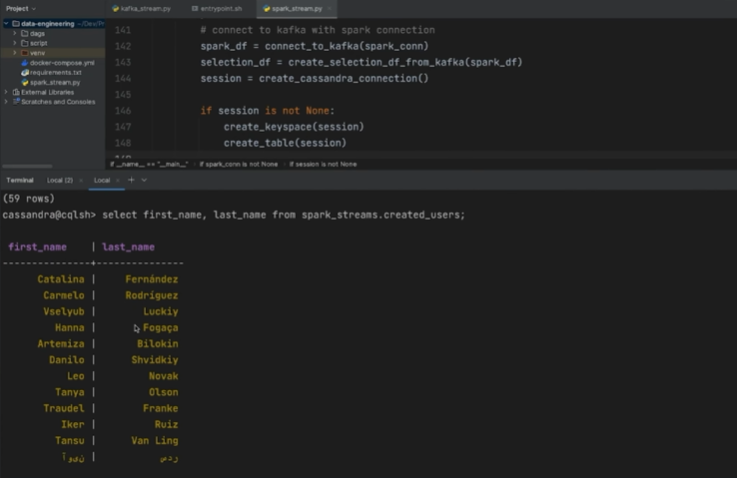

# End-to-End Data Streaming Pipeline.

## How it works :

1. [randomuser.me](http://randomuser.me/) API to generate random user data;
2. Data Ingestion: Raw data is ingested into the system using Kafka. The data can come from various sources like IoT devices, user activity logs, etc;
3. Data Processing: Airflow schedules Spark jobs to process the raw data. The processed data can either be aggregated, filtered, or transformed based on the business logic;
4. Data Storage: The processed data is stored in either Cassandra for NoSQL needs or PostgreSQL for relational data storage;
5. Orchestration: Docker containers encapsulate each component of the architecture, ensuring isolation and ease of deployment.

## Technologies :

- [Spark](https://spark.apache.org/) - Data processing.
- [Docker](https://docs.docker.com/compose/) - neatly containerize everything.
- [Airflow](https://airflow.apache.org/) - manage workflow and store fetched data.
- [Confluent](https://docs.confluent.io/home/overview.html) - fully-managed event streaming platform.
- [Zookeeper](https://zookeeper.apache.org/doc/current/index.html) & [Kafka](https://kafka.apache.org/) - stream data to the processing engine.
- [Cassandra](https://cassandra.apache.org/_/index.html) & [PostgreSQL](https://www.postgresql.org/docs/) - Data storage solutions with reliability and perfomance.

## Why?

This project serves as a comprehensive guide to building an end-to-end data engineering pipeline. It covers each stage from data ingestion to processing and finally to storage, utilizing a robust tech stack that includes Airflow, Python, Kafka, Zookeeper, Spark, and Cassandra. Everything is containerized using Docker for ease of deployment and scalability.

PostgreSQL serves as the database to store activities for Apache Airflow; the choice was based by merely preference. Kafka provides a robust and scalable platform for ingesting real-time data and making it available for processing systems like Spark. By using Kafka, we can ensure that our data is ingested in real-time and is available for Spark to process as soon as it arrives.

You will probrably question yourself: "why use Cassandra when there are other renowned and well-known possibilities?", so here are a few reasons:  (1.) Scalability: Is highly scalable, which makes it a good choice if the project needs to handle a large amount of data in the future. (2.) Fault Tolerance: It provides excellent fault tolerance and data replication capabilities. (3.) Query Flexibility: While it's great for unstructured data, Cassandra also allows for relatively complex queries on structured data, giving us more flexibility in how we use the data later on. (4.) Speed: For some use-cases, Cassandra can offer faster write and read operations compared to traditional RDBMS.

Although the benefits that would be gained from using a Cloud service are obvious, for reasons of not having consolidated studies on the subject, and having thought of such a possibility already in the middle of the project, such a proposal will be left for a future project.

And the more you trigger, the more records you get; but since all of the elements in the system architecture were satisfied, I think it is safe to say we are done :)